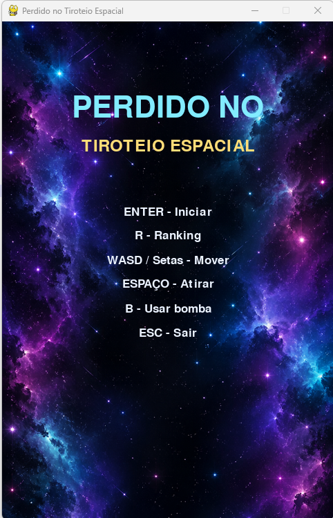
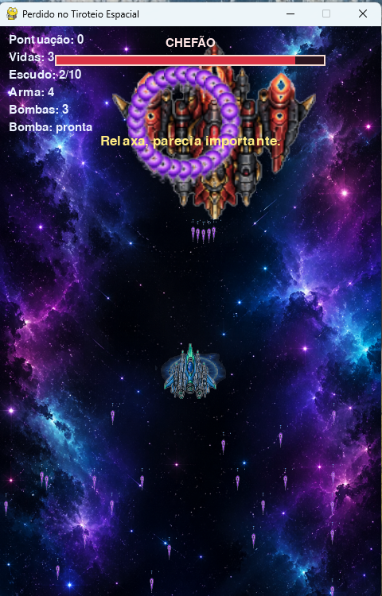

Lost in Space Crossfire
========================

### About

Lost in Space Crossfire is a vertical 2D arcade shooter developed in Python
with Pygame for Uninter's Linguagem de Programação Aplicada practical activity,
under the orientation of professor Vinicius Borin.

The game follows Captain Antônio "Tonhão" Picardo, an unprepared pilot who
accidentally enters the middle of a space battle and has to survive by shooting,
collecting upgrades, using bombs, and calmly pressing every button in complete
despair.

### Screenshots

GAME MENU



BOSS FIGHT



### Features

- Vertical arcade shooter gameplay
- Scripted enemy waves
- Boss battle
- Weapon upgrades
- Bomb system
- Shield system
- Checkpoint continues
- SQLite ranking database
- Opening story, victory screen, and credits
- Picardo Panic System with accidental extra shots during high pressure

### Controls

- `WASD` or arrow keys: move
- `SPACE`: shoot
- `B`: use bomb
- `ENTER`: start, skip story, continue, or restart
- `ESC`: return to menu or exit from the main menu

### How to run

```powershell
cd D:\Python\lost_in_space_crossfire
python -m venv .venv
.\.venv\Scripts\activate
python -m pip install --upgrade pip
python -m pip install -r requirements.txt
python main.py
```

### Build

The game can be packaged for Windows with PyInstaller:

```powershell
pyinstaller LostInSpaceCrossfire.spec --noconfirm
```

The generated executable is created in:

```text
dist/LostInSpaceCrossfire.exe
```

### Ranking database

Scores are saved locally with SQLite in:

```text
data/ranking.db
```

The database file is created automatically when the game runs and is not required in the repository.

### Project structure

```text
assets/                 Game images and sounds
src/                    Game source code
main.py                 Application entry point
requirements.txt        Python dependencies
LostInSpaceCrossfire.spec  PyInstaller build file
```

### Academic information

Developed by Patrick Ribeiro  
RU: 3633860  
Orientation: Professor Vinicius Borin  
Uninter - Linguagem de Programação Aplicada
